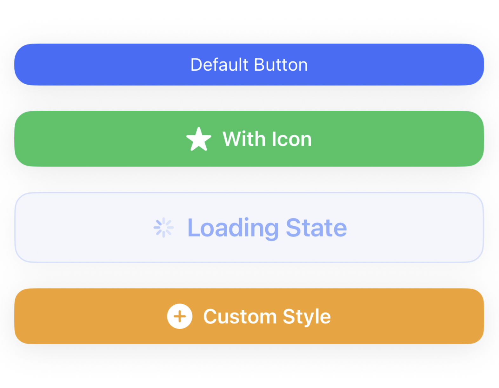
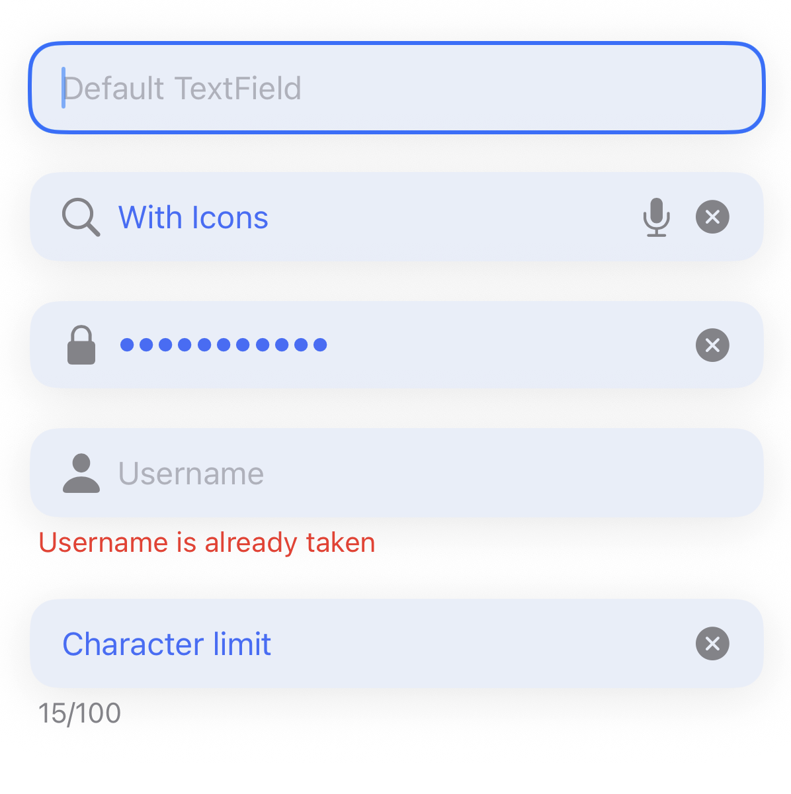
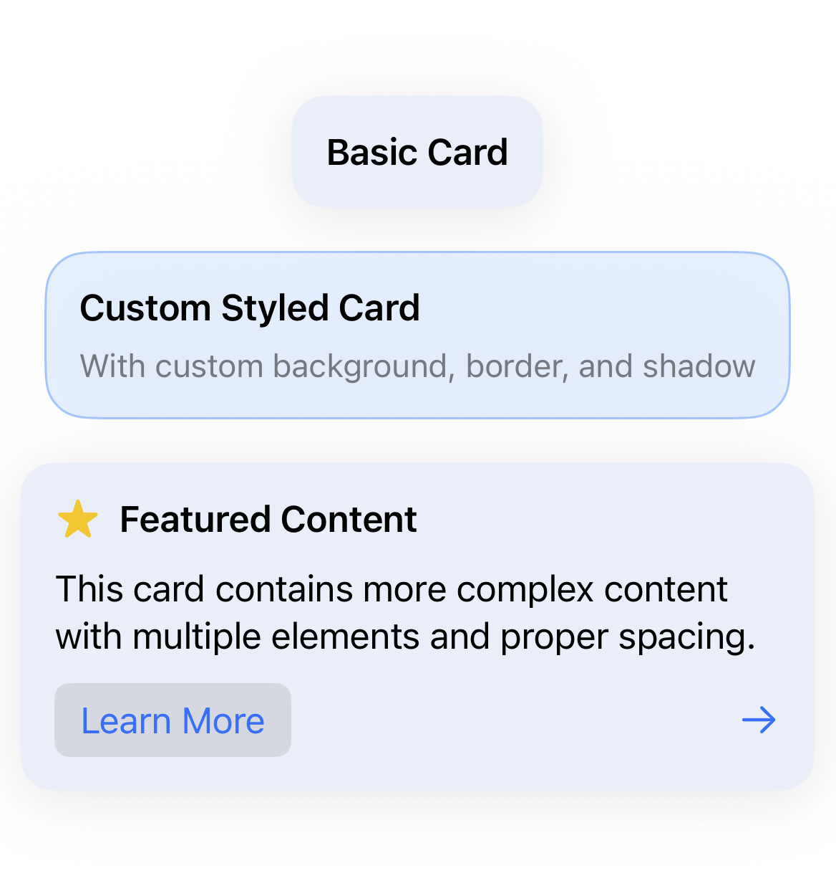
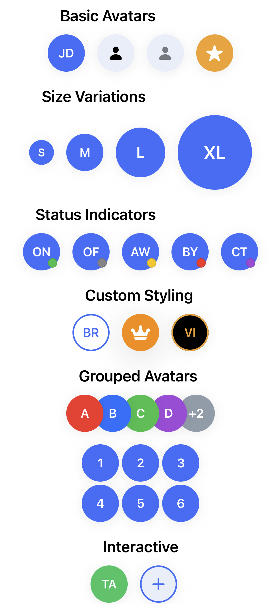
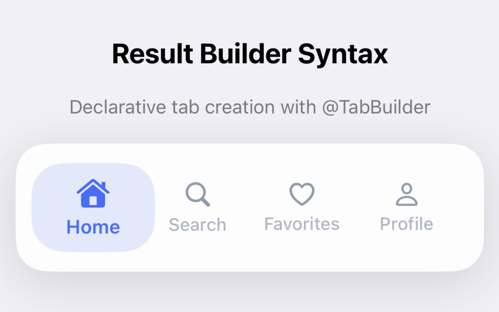
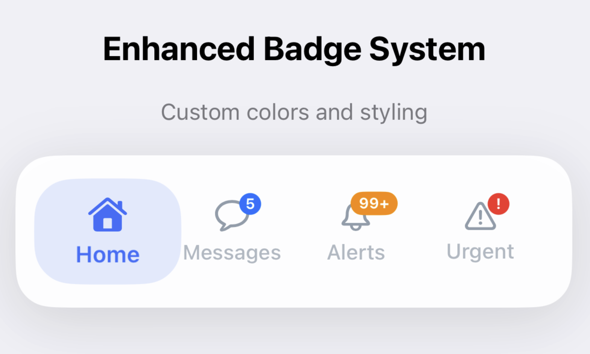
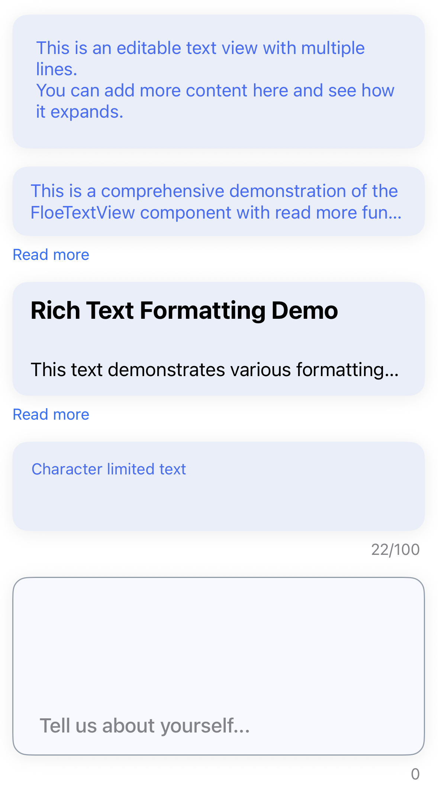

# FloeKit


> **Elegant, modular UI building blocks for SwiftUI**

Inspired by floating ice sheets, **FloeKit** provides calm, elegant, and modular UI components designed for composability, design clarity, and reuse. It positions itself as a thoughtful layer *on top of SwiftUI*, offering a consistent design system with built-in theming, spacing, and typography.


<details>
<summary>📋 Table of Contents</summary>

- [✨ Features](#-features)
- [🚀 Installation](#-installation)
- [🧱 Components](#-components)
  - [FloeButton](#floebutton)
  - [FloeTextField](#floetextfield)
  - [FloeCard](#floecard)
  - [FloeAvatar](#floeavatar)
  - [FloeToast](#floetoast)
  - [FloeTabBar](#floetabbar)
  - [FloeSlider](#floeslider)
  - [FloeTextView](#floetextview)
  - [FloeProgressIndicator](#floeprogressindicator)
  - [FloeSearchBar](#floesearchbar)
  - [FloeSkeleton](#floeskeleton)
  - [FloeSegmentedControl](#floesegmentedcontrol)
  - [FloeEmptyState](#floeemptystate)
  - [FloeBadge](#floebadge)
- [🏗️ Comprehensive Example](#️-comprehensive-example)
- [🛠️ Utilities](#️-utilities)
  - [FloeColors](#floecolors)
  - [FloeFont](#floefont)
  - [FloeSpacing](#floespacing)
  - [FloeShadow](#floeshadow)
- [🎨 Theming](#-theming)
- [📄 License](#-license)
- [🙏 Acknowledgments](#-acknowledgments)

</details>

---

## ✨ Features

- **🎨 Consistent Design System** - Unified colors, typography, spacing, and shadows
- **📱 Cross-Platform** - Works seamlessly on iOS and macOS
- **🌗 Perfect Dark Mode** - ✅ **Complete** - All components tested and beautiful in both light and dark modes
- **♿ Accessibility First** - Built-in VoiceOver, Dynamic Type, and comprehensive accessibility support
- **🏗️ Advanced Architecture** - Result builders, preference keys, haptic feedback, and sophisticated animations
- **🔧 Highly Customizable** - Override any aspect while maintaining design consistency
- **⚡ Performance Optimized** - Efficient SwiftUI implementation with smooth 60fps animations
- **📦 Zero Dependencies** - Pure SwiftUI implementation with no external dependencies
- **🎯 Production Ready** - Battle-tested components with proper error handling and edge cases

---

## 🚀 Installation

### Swift Package Manager

Add FloeKit to your project through Xcode:

1. File → Add Package Dependencies
2. Enter package URL: `https://github.com/nemanjavlahovic/FloeKit`
3. Select version and add to target

Or add to your `Package.swift`:

```swift
dependencies: [
    .package(url: "https://github.com/nemanjavlahovic/FloeKit", from: "0.4.0")
]
```

---

## 🧱 Components

### FloeButton
Advanced buttons with multiple styles, haptic feedback, and group support.



```swift
import FloeKit

// Style presets
FloeButton.primary("Get Started") { }
FloeButton.secondary("Learn More") { }
FloeButton.ghost("Cancel") { }
FloeButton.danger("Delete") { }
FloeButton.success("Confirm") { }
FloeButton.floating("Add", icon: Image(systemName: "plus")) { }

// Custom styling with haptics
FloeButton("Save", 
          style: .primary,
          size: .large,
          hapticStyle: .medium,
          icon: Image(systemName: "checkmark")) {
    // Save action
}

// Button groups
FloeButtonGroup {
    FloeButton.ghost("Cancel") { }
    FloeButton.primary("Save") { }
}

// Vertical button group
FloeButtonGroup(orientation: .vertical) {
    FloeButton.primary("Option 1") { }
    FloeButton.secondary("Option 2") { }
}

// Loading state
FloeButton("Processing...", isLoading: true) { }
```

**Styles:** `.primary`, `.secondary`, `.ghost`, `.danger`, `.success`, `.floating`  
**Sizes:** `.small`, `.medium`, `.large`  
**Haptics:** `.light`, `.medium`, `.heavy`, `.selection`  
**Features:** Loading states, icons, custom colors, haptic feedback, button groups, accessibility support

---

### FloeTextField
Elegant text input with focus states, icons, validation, and character limits.



```swift
@State private var email = ""
@State private var password = ""
@State private var bio = ""

// Basic text field
FloeTextField(text: $email, placeholder: "Email address")

// With icons and validation
FloeTextField(
    text: $email,
    placeholder: "Enter email",
    leadingIcon: Image(systemName: "envelope"),
    errorMessage: "Invalid email format"
)

// Secure field
FloeTextField(
    text: $password,
    placeholder: "Password",
    leadingIcon: Image(systemName: "lock"),
    isSecure: true
)

// With character limit
FloeTextField(
    text: $bio,
    placeholder: "Bio",
    characterLimit: 150
)
```

**Features:** Icons, secure input, validation, character limits, focus states

---

### FloeCard
Interactive containers with selection states, swipe actions, and tap handling.



```swift
// Basic card
FloeCard {
    Text("Card content")
}

// Selectable card
@State private var isSelected = false

FloeCard(
    isSelectable: true,
    isSelected: $isSelected
) {
    Text("Tap to select")
}

// Card with swipe actions
FloeCard(
    leadingSwipeActions: [
        FloeSwipeAction(icon: "checkmark", color: .green) { 
            // Complete action
        }
    ],
    trailingSwipeActions: [
        FloeSwipeAction(icon: "trash", color: .red) { 
            // Delete action
        },
        FloeSwipeAction(icon: "pencil", color: .blue) { 
            // Edit action
        }
    ]
) {
    Text("Swipe for actions")
}

// Interactive card
FloeCard(
    onTap: { print("Tapped") },
    onLongPress: { print("Long pressed") }
) {
    Text("Interactive content")
}

// Custom styling
FloeCard(
    backgroundColor: .blue.opacity(0.1),
    shadowStyle: .elevated,
    padding: .spacious
) {
    // Content
}
```

**Features:** Selection states, swipe actions, tap/long press handlers, custom shadows, haptic feedback

---

### FloeAvatar
Elegant, customizable avatar components with status indicators and grouping support.



```swift
// Basic avatars
FloeAvatar.initials("JD")
FloeAvatar.icon("person.fill")
FloeAvatar.placeholder()

// With image
FloeAvatar(image: Image("user-photo"))

// Different sizes
FloeAvatar.initials("SM", size: .small)
FloeAvatar.initials("LG", size: .large)
FloeAvatar.initials("XL", size: .extraLarge)

// With status indicators
FloeAvatar.online(initials: "ON")
FloeAvatar(initials: "AW", statusIndicator: .away)
FloeAvatar(initials: "BY", statusIndicator: .busy)
FloeAvatar(initials: "CT", statusIndicator: .custom(.purple))

// Custom styling
FloeAvatar(
    initials: "VIP",
    backgroundColor: .black,
    foregroundColor: .yellow,
    borderColor: .yellow,
    borderWidth: 2,
    shadowStyle: .elevated
)

// Interactive avatars
FloeAvatar.initials("TAP") {
    print("Avatar tapped!")
}
```

**Grouped Avatars:**
```swift
// Stacked avatars with overlap
FloeAvatarGroup(
    avatars: [avatar1, avatar2, avatar3],
    style: .stacked,
    maxVisible: 3
)

// Grid layout
FloeAvatarGroup(
    avatars: avatarArray,
    style: .grid(columns: 2)
)
```

**Sizes:** `.small`, `.medium`, `.large`, `.extraLarge`  
**Status:** Online, offline, away, busy, custom colors  
**Features:** Images, initials, SF Symbols, borders, shadows, tap actions, grouping

---

### FloeToast
Lightweight, animated toast notifications with swipe-to-dismiss and customizable styles.

```swift
@StateObject private var toastManager = FloeToastManager()

// Basic usage with convenience methods
.floeToast(FloeToast.success("Success!", message: "Operation completed"))
.floeToast(FloeToast.error("Error!", message: "Something went wrong"))
.floeToast(FloeToast.warning("Warning!", message: "Please check your input"))
.floeToast(FloeToast.info("Info", message: "New update available"))

// Custom toast with action
FloeToast("Custom Toast",
          message: "With action button",
          style: .custom(backgroundColor: .purple, 
                        foregroundColor: .white, 
                        icon: Image(systemName: "star.fill")),
          actionTitle: "Action") {
    // Action handler
}

// Using Toast Manager
toastManager.show(FloeToast.success("Saved successfully!"))

// Advanced configuration
FloeToast("Upload Complete",
          message: "Your file has been uploaded",
          style: .success,
          position: .bottom,
          duration: 5.0,
          actionTitle: "View") {
    // View file action
} onDismiss: {
    print("Toast dismissed")
}
```

**Styles:** Success, warning, error, info, custom  
**Positions:** Top, bottom  
**Features:** Auto-dismiss, swipe gestures, action buttons, custom styling, animations

---

### FloeTabBar
Modern floating tab bar with smooth animations and flexible configuration.




```swift
// Define tabs
let tabs = [
    FloeTabBar.Tab.systemIcon(id: "home", title: "Home", 
                             systemName: "house", selectedSystemName: "house.fill"),
    FloeTabBar.Tab.systemIcon(id: "search", title: "Search", 
                             systemName: "magnifyingglass", badge: "3"),
    FloeTabBar.Tab.systemIcon(id: "favorites", title: "Favorites", 
                             systemName: "heart", selectedSystemName: "heart.fill"),
    FloeTabBar.Tab.systemIcon(id: "profile", title: "Profile", 
                             systemName: "person", selectedSystemName: "person.fill")
]

// Basic tab bar
@State private var selectedTab = "home"

FloeTabBar(
    tabs: tabs,
    selectedTabId: selectedTab,
    onTabSelected: { selectedTab = $0 }
)

// Floating style with central action
FloeTabBar(
    tabs: tabs,
    selectedTabId: selectedTab,
    onTabSelected: { selectedTab = $0 },
    style: .floating,
    indicatorStyle: .pill,
    centralAction: { print("Add new item") },
    centralActionIcon: Image(systemName: "plus.circle.fill")
)

// Scrollable for many tabs
FloeTabBar(
    tabs: manyTabs,
    selectedTabId: selectedTab,
    onTabSelected: { selectedTab = $0 },
    isScrollable: true
)

// Complete tab bar controller
FloeTabBarController(
    tabs: tabs,
    initialSelection: "home",
    style: .floating
) { selectedTab in
    // Content for each tab
    switch selectedTab {
    case "home": HomeView()
    case "search": SearchView()
    case "favorites": FavoritesView()
    case "profile": ProfileView()
    default: EmptyView()
    }
}
```

**Styles:** Floating, attached, minimal  
**Indicators:** Pill, underline, background, none  
**Features:** Badges, central action button, scrollable tabs, animations, custom icons

**Result Builder Syntax:**
```swift
// Declarative tab creation with @TabBuilder
FloeTabBar(
    selectedTabId: selectedTab,
    onTabSelected: { selectedTab = $0 },
    style: .floating,
    indicatorStyle: .pill
) {
    FloeTabBar.Tab.systemIcon(id: "home", title: "Home", systemName: "house")
    FloeTabBar.Tab.systemIcon(id: "search", title: "Search", systemName: "magnifyingglass")
    FloeTabBar.Tab.systemIcon(id: "favorites", title: "Favorites", systemName: "heart")
    FloeTabBar.Tab.systemIcon(id: "profile", title: "Profile", systemName: "person")
}
```

---

### FloeSlider
Customizable slider with haptic feedback, value labels, and both horizontal/vertical orientations.

```swift
@State private var volume: Double = 50
@State private var brightness: Double = 0.7

// Basic slider
FloeSlider(value: $volume, in: 0...100, showLabels: .value)

// Percentage slider with convenience method
FloeSlider.percentage(value: $volume, showLabels: true)

// Volume-style slider (0-1)
FloeSlider.volume(value: $brightness)

// Custom range with steps
FloeSlider(
    value: $rating,
    in: 0...5,
    step: 0.5,
    showLabels: .value,
    showMinMax: true
)

// Vertical slider
FloeSlider(
    value: $volume,
    in: 0...100,
    orientation: .vertical,
    showLabels: .percentage
)
.frame(height: 200)

// Custom styling
FloeSlider(
    value: $temperature,
    in: 16...30,
    showLabels: .custom({ "\(Int($0))°C" }),
    fillColor: .orange,
    thumbColor: .red,
    enableHaptics: true
)
```

**Orientations:** Horizontal, vertical  
**Label Styles:** None, value, percentage, custom formatter  
**Features:** Haptic feedback, range indicators, step values, custom styling, accessibility

---

### FloeTextView
Rich text display and editing component with expansion controls and character limits.



```swift
@State private var editableText = ""
@State private var limitedText = ""

// Basic editable text view
FloeTextView(
    text: $editableText,
    placeholder: "Enter your thoughts...",
    size: .medium
)

// Read-only with expansion
FloeTextView.readOnly(
    text: "Long text content that can be expanded...",
    expansionStyle: .readMore(previewLines: 2)
)

// With character limit
FloeTextView.withCharacterLimit(
    text: $limitedText,
    placeholder: "Bio (max 100 characters)",
    characterLimit: 100,
    size: .small
)

// Attributed text with rich formatting
FloeTextView.attributedText(
    attributedString,
    size: .medium,
    expansionStyle: .readMore(previewLines: 3)
)
```

**Sizes:** `.small`, `.medium`, `.large`  
**Expansion Styles:** Read more/less, character limits, custom  
**Features:** Rich text support, smooth animations, character counting, accessibility

---

### FloeProgressIndicator
Versatile progress indicators with linear and circular styles, supporting both determinate and indeterminate states.


```swift
@State private var progress: Double = 0.65

// Linear progress indicators
FloeProgressIndicator(
    progress: progress,
    style: .linear,
    size: .medium,
    showPercentage: true
)

// Circular progress indicators
FloeProgressIndicator(
    progress: 0.75,
    style: .circular,
    size: .large,
    showPercentage: true
)

// Indeterminate loading
FloeProgressIndicator.indeterminate(
    style: .circular,
    size: .medium,
    color: .blue
)

// State-based indicators
FloeProgressIndicator.loading(style: .circular, size: .medium)
FloeProgressIndicator.success(style: .circular, size: .medium)
FloeProgressIndicator.error(style: .circular, size: .medium)

// Custom styling
FloeProgressIndicator(
    progress: progress,
    style: .linear,
    size: .large,
    color: .purple,
    backgroundColor: .gray.opacity(0.2),
    showPercentage: true
)
```

**Styles:** Linear, circular  
**States:** Determinate, indeterminate, loading, success, error  
**Sizes:** `.small`, `.medium`, `.large`  
**Features:** Smooth animations, custom colors, percentage display, accessibility

---

### FloeSearchBar
Enhanced search bar with modern styling and functionality.

```swift
@State private var searchText = ""

// Basic search bar
FloeSearchBar(
    text: $searchText,
    placeholder: "Search...",
    onSearchSubmit: { query in
        print("Searching for: \(query)")
    }
)

// Search bar with voice input
FloeSearchBar.withVoiceSearch(
    text: $searchText,
    placeholder: "Search with voice...",
    onVoiceSearch: { activateVoiceSearch() }
)

// Search bar with filter
FloeSearchBar.withFilter(
    text: $searchText,
    placeholder: "Search and filter...",
    onFilter: { showFilterOptions() }
)

// Search bar with cancel button
FloeSearchBar.withCancelButton(
    text: $searchText,
    placeholder: "Search...",
    onCancel: { clearSearch() }
)
```

**Features:** Auto-clear button, focus states, voice search support, filter integration, cancel button, custom styling, accessibility support

---

### FloeSkeleton
Skeleton loading components for beautiful placeholder UI while content loads.

```swift
// Basic skeleton shapes
FloeSkeleton.avatar(size: 40)
FloeSkeleton.text(lines: 3)
FloeSkeleton.button(width: 100, height: 40)

// Post skeleton with automatic layout
FloeSkeleton.post()

// Multiple loading items
FloeSkeletonLoading(count: 3) {
    FloeSkeleton.listItem()
}

// Custom skeleton with different animations
FloeSkeleton(
    style: .rectangle(width: 200, height: 40),
    animationType: .shimmer,
    cornerRadius: 8
)

// NEW: Skeleton View Modifiers - Apply to any view!
@State private var isLoading = true

// Apply skeleton to any view
MyComplexCard()
    .floeSkeleton($isLoading)

// Skeleton for text content
Text("User Name")
    .floeTextSkeleton($isLoading)

Text("Multi-line content here")
    .floeTextSkeleton($isLoading, lines: 2, lastLineWidth: 0.6)

// Skeleton for buttons
FloeButton("Save") { }
    .floeSkeleton($isLoading, cornerRadius: 16)

// Skeleton for avatars
FloeAvatar.initials("JD")
    .floeSkeleton($isLoading, cornerRadius: 25)

// Custom animation types
AnyView()
    .floeSkeleton($isLoading, animationType: .pulse)
    .floeSkeleton($isLoading, animationType: .wave)
    .floeSkeleton($isLoading, animationType: .shimmer)
```

**Styles:** Text, circle, rectangle, card, custom  
**Animations:** Shimmer, pulse, wave, none  
**Features:** Multiple animation types, customizable colors, automatic staggered loading, convenience methods for common use cases, **view modifiers for any SwiftUI view**

---

### FloeSegmentedControl
Modern segmented control with multiple styles and smooth animations.

```swift
@State private var selectedTimeRange = "Day"
@State private var selectedTab = "Active"

// Pill style (default)
FloeSegmentedControl(
    selection: $selectedTimeRange,
    options: ["Day", "Week", "Month", "Year"],
    style: .pill
)

// Underline style
FloeSegmentedControl(
    selection: $selectedTab,
    options: ["All", "Active", "Completed"],
    style: .underline
)

// Card style
FloeSegmentedControl(
    selection: $selectedTab,
    options: ["Active", "Paused", "Archived"],
    style: .card,
    accentColor: FloeColors.success
)

// With icons
FloeSegmentedControlWithIcons(
    selection: $selectedTab,
    options: [
        .init(id: "home", title: "Home", icon: "house", selectedIcon: "house.fill"),
        .init(id: "search", title: "Search", icon: "magnifyingglass"),
        .init(id: "profile", title: "Profile", icon: "person", selectedIcon: "person.fill")
    ]
)

// Icon-only
FloeSegmentedControlWithIcons(
    selection: $selectedTab,
    options: [
        .init(id: "home", icon: "house", selectedIcon: "house.fill"),
        .init(id: "search", icon: "magnifyingglass"),
        .init(id: "favorites", icon: "heart", selectedIcon: "heart.fill")
    ],
    style: .card,
    showTitles: false
)
```

**Styles:** `.pill`, `.underline`, `.card`  
**Features:** Smooth animations, haptic feedback, icon support, customizable colors

---

### FloeEmptyState
Beautiful empty state views for onboarding, errors, and no-data scenarios.

```swift
// Basic empty state
FloeEmptyState(
    icon: "sparkles",
    title: "Your day awaits",
    message: "No activities scheduled for today"
) {
    FloeButton.primary("Create First Habit") { }
}

// Preset states
FloeEmptyState.noData()
FloeEmptyState.error(retryAction: { /* retry */ })
FloeEmptyState.success(title: "All Done!")
FloeEmptyState.search(clearAction: { /* clear */ })
FloeEmptyState.loading(message: "Fetching data...")

// Custom styling
FloeEmptyState(
    customIcon: Image("custom-illustration"),
    title: "Welcome!",
    message: "Let's get started",
    style: .large,
    iconColor: FloeColors.accent
) {
    FloeButtonGroup {
        FloeButton.ghost("Learn More") { }
        FloeButton.primary("Get Started") { }
    }
}
```

**Styles:** `.compact`, `.standard`, `.large`  
**Presets:** No data, error, success, search, loading  
**Features:** Animated entrance, custom icons, action buttons, multiple sizes

---

### FloeBadge
Notification badges, status indicators, and count displays.

```swift
// Basic badges
Image(systemName: "bell")
    .floeBadge("3")

Image(systemName: "message")
    .floeDotBadge()

// Count badges with max
Image(systemName: "envelope")
    .floeBadge(count: 150, max: 99) // Shows "99+"

// Custom positions
SomeView()
    .floeBadge("NEW", position: .topTrailing)
    .floeBadge("5", position: .bottomLeading)

// Preset badges
FloeBadge.notification(count: 5)
FloeBadge.status(online: true)
FloeBadge.streak(7) // Shows "7🔥"
FloeBadge.new()
FloeBadge.pro()

// On components
FloeAvatar.initials("JD")
    .floeBadge(FloeBadge.status(online: true), position: .bottomTrailing)

FloeButton.primary("Notifications") { }
    .floeBadge(count: 3)

FloeCard {
    Text("New Feature")
}
.floeBadge(FloeBadge.new())
```

**Styles:** `.number`, `.dot`, `.icon`, `.text`  
**Positions:** `.topTrailing`, `.topLeading`, `.bottomTrailing`, `.bottomLeading`  
**Features:** Animated appearance, count limits, preset styles, works with any view

---

## 🏗️ Comprehensive Example

Here's how FloeKit components work together in a real application:

```swift
import SwiftUI
import FloeKit

struct ProfileView: View {
    @State private var name = ""
    @State private var bio = ""
    @State private var selectedTab = "profile"
    @State private var showSuccessToast = false
    
    var body: some View {
        FloeTabBarController(
            initialSelection: "profile",
            style: .floating
        ) {
            FloeTabBar.Tab.systemIcon(id: "profile", title: "Profile", systemName: "person")
            FloeTabBar.Tab.systemIcon(id: "settings", title: "Settings", systemName: "gear")
        } content: { selectedTab in
            ScrollView {
                VStack(spacing: FloeSpacing.Size.lg.value) {
                    // Avatar Section
                    FloeCard {
                        VStack(spacing: FloeSpacing.Size.md.value) {
                            FloeAvatar.initials("JD", size: .extraLarge)
                            Text("John Doe")
                                .floeFont(.headline)
                        }
                        .frame(maxWidth: .infinity)
                    }
                    
                    // Form Section
                    FloeCard(padding: .comfortable) {
                        VStack(spacing: FloeSpacing.Size.md.value) {
                            FloeTextField(
                                text: $name,
                                placeholder: "Full Name",
                                leadingIcon: Image(systemName: "person.fill")
                            )
                            
                            FloeTextView.withCharacterLimit(
                                text: $bio,
                                placeholder: "Tell us about yourself...",
                                characterLimit: 150,
                                size: .medium
                            )
                            
                            FloeButton("Save Profile",
                                      size: .large,
                                      backgroundColor: FloeColors.primary,
                                      textColor: .white) {
                                showSuccessToast = true
                            }
                        }
                    }
                    
                    // Progress Section
                    FloeCard {
                        VStack(alignment: .leading, spacing: FloeSpacing.Size.sm.value) {
                            Text("Profile Completion")
                                .floeFont(.headline)
                            
                            FloeProgressIndicator(
                                progress: 0.75,
                                style: .linear,
                                size: .medium,
                                showPercentage: true
                            )
                        }
                    }
                }
                .floePadding(.comfortable)
            }
            .floeToast(showSuccessToast ? 
                FloeToast.success("Profile Updated!", 
                                 message: "Your changes have been saved") {
                    showSuccessToast = false
                } : nil
            )
        }
    }
}
```

**This example demonstrates:**
- **FloeTabBarController** with multiple screens
- **FloeCard** for clean content organization  
- **FloeAvatar** for user representation
- **FloeTextField** with icons for form input
- **FloeTextView** with character limits for longer text
- **FloeButton** for primary actions
- **FloeProgressIndicator** for status display
- **FloeToast** for user feedback
- **FloeSpacing** and **FloeFont** for consistent styling

---

## 🛠️ Utilities

### FloeColors
Adaptive color palette with seamless light/dark mode support.

```swift
// Primary semantic colors
.foregroundColor(FloeColors.primary)     // Main brand color
.backgroundColor(FloeColors.secondary)   // Secondary brand color
.foregroundColor(FloeColors.accent)      // Accent highlights
.foregroundColor(FloeColors.error)       // Error states

// Surface colors
.backgroundColor(FloeColors.background)  // Main background
.backgroundColor(FloeColors.surface)     // Card/component backgrounds

// Neutral scale for subtle elements
.foregroundColor(FloeColors.neutral0)    // Pure contrast
.foregroundColor(FloeColors.neutral10)   // High contrast text
.foregroundColor(FloeColors.neutral20)   // Medium contrast borders
.foregroundColor(FloeColors.neutral30)   // Low contrast dividers
.foregroundColor(FloeColors.neutral40)   // Subtle text
.foregroundColor(FloeColors.neutral90)   // Very subtle backgrounds

// State colors
.foregroundColor(FloeColors.success)     // Success feedback
.foregroundColor(FloeColors.warning)     // Warning states
```

**✅ All colors automatically adapt to light/dark mode**  
**✅ Consistent contrast ratios for accessibility**  
**✅ Can be overridden via color assets for custom theming**

---

### FloeFont
Typography system with semantic font styles.

```swift
Text("Headline")
    .floeFont(.headline)

Text("Body text")
    .floeFont(.body)

// Or with custom size and weight
Text("Custom")
    .floeFont(size: .xl, weight: .bold)

// Available styles: .body, .caption, .button, .title, .headline, .subheadline
// Available sizes: .xs, .sm, .base, .lg, .xl, .xl2, .xl3, .xl4
```

---

### FloeSpacing
Consistent spacing and padding system.

```swift
// Use spacing tokens
VStack(spacing: FloeSpacing.Size.lg.value) {
    // Content
}

// Apply semantic padding
SomeView()
    .floePadding(.card)        // Standard card padding
    .floePadding(.section)     // Section container padding
    .floePadding(.comfortable) // Comfortable all-around padding
    .floePadding(.spacious)    // Spacious padding
    .floePadding(.generous)    // Generous padding

// Custom spacing
SomeView()
    .floePadding(.vertical, .lg)
    .floePadding(.horizontal, .xl)
```

---

### FloeShadow
Consistent shadow system with automatic dark mode adaptation.

```swift
// Apply semantic shadows
RoundedRectangle(cornerRadius: 12)
    .floeShadow(.soft)      // Subtle shadow
    .floeShadow(.medium)    // Standard shadow
    .floeShadow(.elevated)  // Strong shadow

// Available styles: .none, .subtle, .soft, .medium, .elevated
```

---

## 🎨 Theming

FloeKit supports comprehensive theming through color asset overrides:

1. Add a `Colors.xcassets` to your app
2. Create color sets with FloeKit's color names:
   - `FloePrimary`, `FloeSecondary`, `FloeAccent`
   - `FloeBackground`, `FloeSurface`
   - `FloeNeutral0`, `FloeNeutral10`, `FloeNeutral20`, `FloeNeutral30`, `FloeNeutral40`, `FloeNeutral90`
3. FloeKit will automatically use your custom colors

---

## 📄 License

FloeKit is available under the MIT license. See [LICENSE](LICENSE) for details.

---

## 🙏 Acknowledgments

Inspired by modern design systems and the SwiftUI community's best practices.

---
